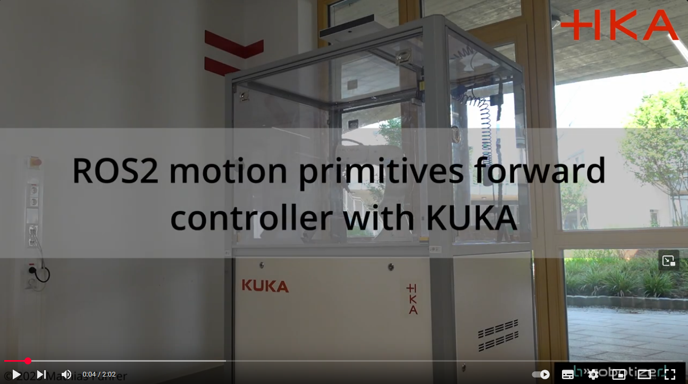
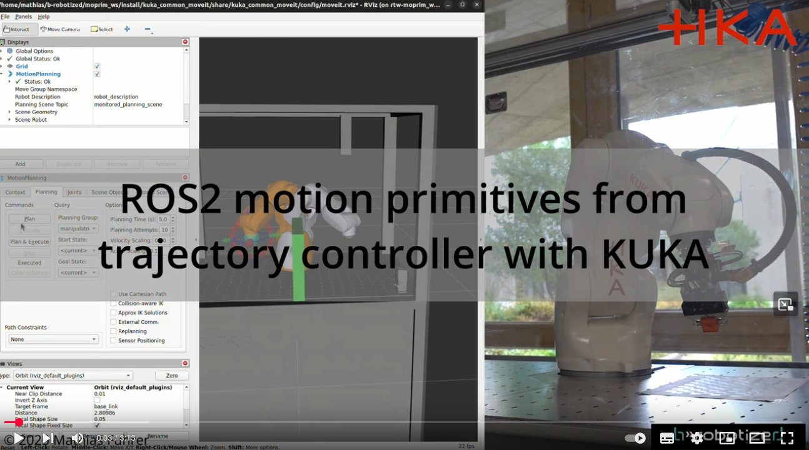
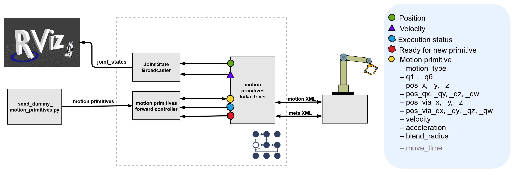
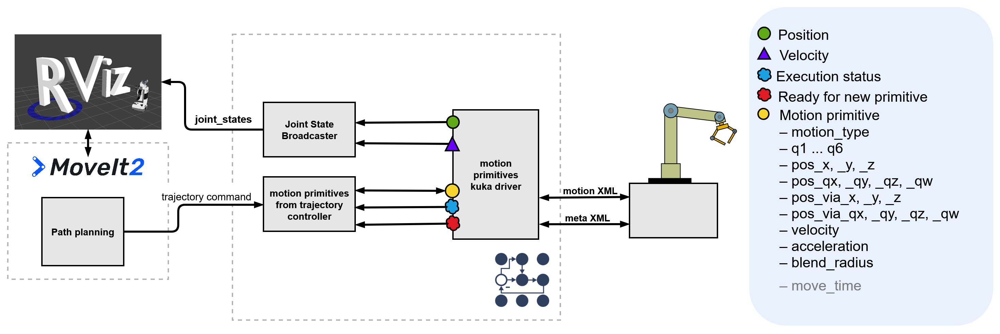
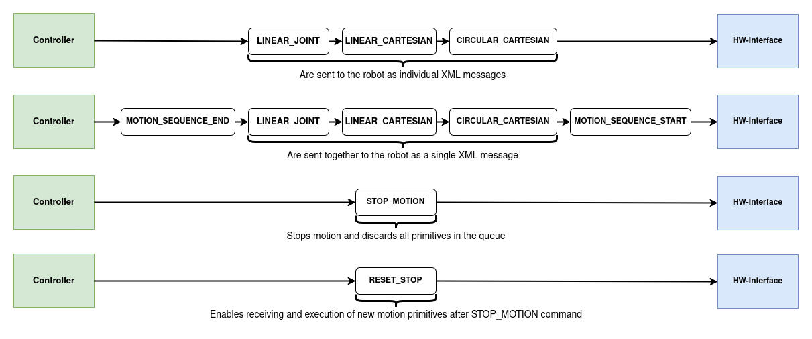
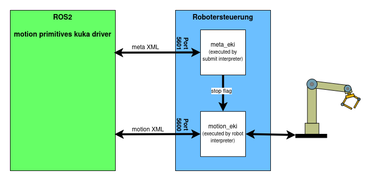

kuka_eki_motion_primitives_hw_interface
==========================================

Hardware interface for executing motion primitives on a KUKA robot using the ROS 2 control framework. It allows the controller to execute linear (LINEAR_CARTESIAN/ LIN/ MOVEL), circular (CIRCULAR_CARTESIAN/ CIRC/ MOVEC) and joint-based (LINEAR_JOINT/ PTP/ MOVEJ) motion commands.

[](https://opensource.org/licenses/Apache-2.0)

# Demo Video with motion_primitives_forward_controller
[](https://youtu.be/_BWCO36j9bg)

# Demo Video with motion_primitives_from_trajectory_controller
[](https://youtu.be/SvUU6PM1qRk)

# Architecture
**with motion_primitives_forward_controller**


**with motion_primitives_from_trajectory_controller**


# Command and State Interfaces

The `motion_primitives_kuka_driver` hardware interface defines a set of **command interfaces** and **state interfaces** used for communication between the controller and the robot hardware.

## Command Interfaces

These interfaces are used to send motion primitive data to the hardware interface:

- `motion_type`: Type of motion primitive (e.g., LINEAR_JOINT, LINEAR_CARTESIAN, CIRCULAR_CARTESIAN, etc.)
- `q1` – `q6`: Target joint positions for joint-based motion
- `pos_x`, `pos_y`, `pos_z`: Target cartesian position
- `pos_qx`, `pos_qy`, `pos_qz`, `pos_qw`: Orientation quaternion of the target pose
- `pos_via_x`, `pos_via_y`, `pos_via_z`: Intermediate via-point position for circular motion
- `pos_via_qx`, `pos_via_qy`, `pos_via_qz`, `pos_via_qw`: Orientation quaternion of via-point
- `velocity`: Desired motion velocity. For joint-based motions (PTP), it specifies the joint velocitiy in rad/s and for cartesian motions (LIN, CIRC), it specifies the end-effector velocity in m/s.
- `acceleration`: Desired motion acceleration. For joint-based motions (PTP), it specifies the joint acceleration in rad/s² and for cartesian motions (LIN, CIRC), it specifies the end-effector acceleration in m/s².
- `blend_radius`: Blending radius for smooth transitions between two primitives.
- `move_time`: Optional duration for time-based execution (currently not used by the **motion_primitive_kuka_driver**, but [**UR driver**](https://github.com/b-robotized-forks/Universal_Robots_ROS2_Driver_MotionPrimitive) uses it)

## State Interfaces

These interfaces are used to communicate the internal status of the hardware interface back to the controller:
- `joint positions`: Used by the `joint_state_broadcaster` and allows tools like RViz to visualize the current robot state.
- `joint velocitys`
- `execution_status`: Indicates the current execution state of the primitive. Possible values are:
  - `IDLE`: No motion in progress
  - `EXECUTING`: Currently executing a primitive
  - `ERROR`: An error occurred during execution
  - `STOPPED`: The robot was stopped using the `STOP_MOTION` command and must be reset with the `RESET_STOP` command before executing new commands.
  - `SUCCESS`: Execution was successfull
- `ready_for_new_primitive`: Boolean flag indicating whether the interface is ready to receive a new motion primitive

# Supported Motion Primitives

- Support for basic motion primitives:
  - `LINEAR_JOINT`
  - `LINEAR_CARTESIAN`
  - `CIRCULAR_CARTESIAN`
- Additional helper types:
  - `STOP_MOTION`: Immediately stops the current robot motion and clears all pending primitives in the controller's queue.
  - `RESET_STOP`: After `RESET_STOP`, new commands can get handled.
  - `MOTION_SEQUENCE_START` / `MOTION_SEQUENCE_END`: Define a motion sequence block. All primitives between these two markers will be sent to the robot in a single XML message, rather than as individual messages. Within a sequence, blending can be used to enable smooth transitions between movements.



# Implementation

In contrast to the "standard" hardware interface, this driver does not compute or execute trajectories on the ROS 2 side. Instead, it passes high-level motion primitives directly to the robot controller, which then computes and executes the trajectory internally.

This approach offers two key advantages:

- **Reduced real-time requirements** on the ROS 2 side, since trajectory planning and execution are offloaded to the robot.
- **Improved motion quality**, as the robot controller has better knowledge of the robot's kinematics and dynamics, leading to more optimized and accurate motion execution.

## Communication Between Hardware Interface and Robot

The communication between the hardware interface and the robot is managed via two [Ethernet KRL Interfaces (EKI)](https://my.kuka.com/s/product/kukaethernet-krl-40/01t1i0000049YnEAAU?language=en_US&tab=Functions).  

- **Motion EKI**: Transfers motion primitives and returns state information (e.g., joint positions, velocities, etc.).  
- **Meta EKI**: Handles the transmission of `STOP_MOTION` and `RESET_STOP` commands.  

Message exchange over EKI is conducted using XML messages.



## Sending Commands to the Robot

The `write()` method checks whether a new motion primitive command has been received from the controller via the command interfaces. If a new command is present:

1. **Meta Commands (`STOP_MOTION`, `RESET_STOP`)**  
   - If the command is `STOP_MOTION`, it is sent directly to the robot controller via the Meta EKI connection. This sets a flag in the `meta_eki.sub` program on the robot.  
   - This flag triggers an interrupt in the `motion_eki.src` program, which immediately stops the current motion execution and discards all further motion commands.  
   - If a `RESET_STOP` command is received, the flag is reset, allowing new motion primitives to be received and executed.

2. **Motion Commands (`LINEAR_JOINT`, `LINEAR_CARTESIAN`, `CIRCULAR_CARTESIAN`, `MOTION_SEQUENCE_START`, `MOTION_SEQUENCE_END`)**  
   - For regular motion commands like `LINEAR_JOINT`, `LINEAR_CARTESIAN`, and `CIRCULAR_CARTESIAN`, a corresponding `MoveCommand` is created and sent to the robot via the Motion EKI connection.  
   - If a `MOTION_SEQUENCE_START` command is received, all subsequent primitives are collected into a motion sequence.  
   - When the `MOTION_SEQUENCE_END` command is received, the entire sequence is transmitted to the robot as a single XML message.  
   - The actual sending of these commands to the robot is handled in a separate thread, ensuring the main program remains non-blocking.

## Reading states of the robot and sending status informations to the controller

The `read()` method:
- Retrieves the joint positions and velocities of the robot and publishes them via the corresponding state interfaces. These can then be read by the joint_state_broadcaster, allowing tools like RViz to visualize the current robot state.
- Publishes the `execution_status` over a state interface with possible values: `IDLE`, `EXECUTING`, `ERROR`, `STOPPED`, `SUCCESS`.
- Publishes `ready_for_new_primitive` over a state interface to signal whether the interface is ready to receive a new primitive.

## KUKA KRL implementation
Instructions for the KRL implementation and how to deploy it on the robot controller are documented in the [README in the KRL folder](krl/README.md).


# Usage notes:
## "Simulation"
```
ros2 run kuka_eki_simulator kuka_eki_simulator_tcp
```
> [!NOTE]  
> **This is not a proper simulation, but it can be helpful for debugging.**
> - **Motion Channel:** Currently, only the motion primitive channel is implemented. The meta channel for interrupting movements is not implemented.
> - **Single PTP Commands:** If the simulator receives an XML message containing only a single PTP (point-to-point) command, the robot's joint positions are set directly to those specified in the command.
> - **Cartesian Commands:** Since no inverse kinematics (IK) is implemented, all joint positions are simply set to zero when a Cartesian command is received.
> - **Multi-Primitive XML:** The simulator cannot correctly process XML messages containing multiple motion primitives. However, the received XML is printed, which is usually sufficient for debugging purposes.


## With motion_primitives_forward_controller
**Driver with "simulation"**
> [!NOTE]   
> Start simulation as explained above.
```
ros2 launch kuka_ros2_control_support motion_primitives_forward_bringup.launch.py description_package:=kuka_ready2_educate_support description_macro_file:=ready2_educate_macro.xacro
```
**Driver with ready2educate H-KA cell 2** (adjust robot_ip for other cells)
> [!NOTE]   
> Make sure to follow the instructions in the [README file in the KRL folder](krl/README.md) to setup the robot before launching the hardware interface.
```
ros2 launch kuka_ros2_control_support motion_primitives_forward_bringup.launch.py description_package:=kuka_kr3_support description_macro_file:=kr3r540_macro.xacro eki_robot_ip:=10.181.116.51
```
**Send motion primitives from python script**
> [!WARNING]  
> Ensure that the robot in your configuration is able to execute these motion primitives without any risk of collision.
```
ros2 run kuka_eki_motion_primitives_hw_interface send_dummy_motion_primitives.py
```
During the execution of the motion primitives, the movement can be stopped by pressing the Enter key in the terminal.


## With motion_primitives_from_trajectory_controller
**Start MoveIt and RViz:**
```
ros2 launch kuka_common_moveit kuka_moveit.launch.py kuka_type:=ready2_educate
```
**Start controller and hardware interface with "simulation":**
> [!NOTE]   
> Start simulation as explained above.
```
ros2 launch kuka_ros2_control_support motion_primitives_from_traj_bringup.launch.py description_package:=kuka_ready2_educate_support description_macro_file:=ready2_educate_macro.xacro start_rviz:=false robot_name:=ready2_educate
```
**Start controller and hardware interface with ready2educate H-KA cell 2:**
```
ros2 launch kuka_ros2_control_support motion_primitives_from_traj_bringup.launch.py description_package:=kuka_ready2_educate_support description_macro_file:=ready2_educate_macro.xacro start_rviz:=false use_mock_hardware:=false eki_robot_ip:=10.181.116.51 robot_name:=ready2_educate
```

**(H-KA KR210)**
```
ros2 launch kuka_common_moveit kuka_moveit.launch.py kuka_type:=kuka_kr210r3100
```
```
ros2 launch kuka_ros2_control_support motion_primitives_from_traj_bringup.launch.py description_package:=kuka_kr210_support description_macro_file:=kr210r3100_macro.xacro start_rviz:=false use_mock_hardware:=false eki_robot_ip:=172.31.1.178 robot_name:=kuka_kr210r3100
```

# TODOs/ Improvements
- KRL: Occasionally, the error "Kontrollstruktur nächster Satz" occurs when stopping/ canceling movement. This error must be acknowledged on the touch panel before the program can continue. Why does this error occur?
- KRL: Get max_joit_acc and calculate acc_scale=acceleration/max_joit_acc to set $ACC_AXIS[] --> for now, joint acceleration is set to 50%
- KRL: Execute eki_close() when programm is stopped/ deselected to properly close the connection --> without eki_close() its not possible to init a new server when restarting the program.
