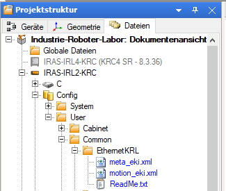
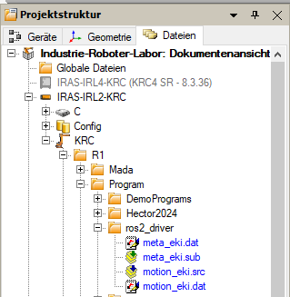
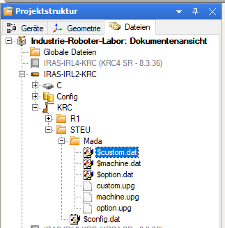
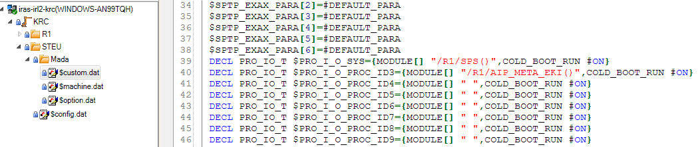
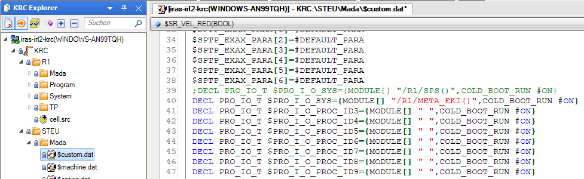
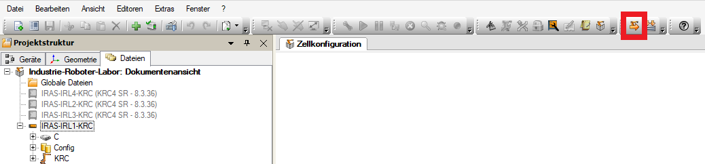

# Tutorial to setup KUKA robot for motion_primitives_kuka_driver

> [!NOTE]  
> This is a modified version of the [ready2educate cell tutorial](https://github.com/IRAS-HKA/r2e_tutorial/blob/cell_setup/README.md) by Gergely Soti.

> [!NOTE]   
> This tutorial is based on the [ready2educate cell](https://www.kuka.com/en-us/products/robotics-systems/kuka-ready2_use/kuka-ready2_educate) with a [KR3 R540 robot](https://my.kuka.com/s/product/kr-3-r540/01t58000002hniqAAA?language=en_US&tab=Overview) at the [H-KA Robot-Lab](https://www.h-ka.de/iaf/ausstattung/fakultaetsuebergreifendes-industrie-roboter-labor-fuer-die-lehre)  but can also be adapted to other robot setups.

> [!NOTE]   
> The KRL files originate from a previous implementation by the Karlsruhe University of Applied Sciences (H-KA) and have been adapted here for the motion_primitives_kuka_driver. The included gripper control implementation was not used in this context and, therefore, has not been tested. However, these parts of the code have been retained for potential future developments.

## First Time Setup - Robot
1. Boot up the robot
2. Boot up the Windows PC and log in with your RZ account
3. Download KRL sources from the `krl_sources` directory
4. Change IP in [`motion_eki.xml`](motion_eki.xml) and [`meta_eki.xml`](meta_eki.xml) to match the robot controller's IP (should be found on the robot cell somewhere)
5. Create new project on KUKA smartPAD (teach pendant) with KUKA smartHMI (touch screen user interface)
    - Open main menu (key with small robot in the bottom right on smartPAD or top left in smartHMI) &rarr; _Öffnen_
    - _Konfiguration_ &rarr; _Benutzergruppe_ &rarr; _Administrator_ (pass: kuka)
    - Open project management window (blue WorkVisual icon - gear with robot in it - on smartHMI)
        - "Ready2Educate" is the active project:
            - _Aktuellen Zustand sichern_
            - Name: "ros2_driver" &rarr; _OK_
            - select "ros2_driver" in _Verfügbare Projekte_ &rarr; _Entpinnen_
            - _Aktivieren_
        - "Ready2Educate" is not the active project:
            - Pin "Ready2Educate"
            - _Aktivieren_ &rarr; type in new project name, e.g. "ros2_driver" &rarr; confirm with _OK_
    - Confirm _Wollen Sie die Aktivierung des Projektes "ros2_driver" zulassen?_ with _Ja_
    - Confirm _Projektverwaltung_ panel _Wollen Sie fortfahren?_ with _Ja_
    - Wait until project is activated
6. Insert KRL sources in new project
    - On Windows PC open WorkVisual
    - Load newly created project "ros2_driver" from robot cell
        - _Datei_ &rarr; _Projekt öffnen_ &rarr; _Suchen_
        - Select cell with the corresponding IP
        - Select project "ros2_driver"
        - _Öffnen_
    - Navigate to "Dateien" tab in the left panel
    - Copy the files [`motion_eki.xml`](motion_eki.xml) and [`meta_eki.xml`](meta_eki.xml), modified in step 4, to `IRAS-IRL<X>-KRC/Config/User/Common/EthernetKRL`  

      

    - Create new folder `IRAS-IRL<X>-KRC/KRC/R1/Program/ros2_driver`
    - Copy [`motion_eki.dat`](motion_eki.dat), [`meta_eki.dat`](meta_eki.dat), [`motion_eki.src`](motion_eki.src) and [`meta_eki.sub`](meta_eki.sub) to `IRAS-IRL<X>-KRC/KRC/R1/Program/ros2_driver`  

      

    - Edit the `$custom.dat` file.

         

        If [Multi Submitinterpreter](https://www.kuka.com/en-us/services/downloads?terms=Language%3Aen%3A1&q=MultiSubmit) is installed the line `DECL PRO_IO_T $PRO_I_O_PROC_ID3={MODULE[] " ",COLD_BOOT_RUN #ON}` in `$custom.dat` can be modified to `DECL PRO_IO_T $PRO_I_O_PROC_ID3={MODULE[] "/R1/AIP_META_EKI()",COLD_BOOT_RUN #ON}`. The `sps.sub` and `meta_eki.sub` will run in parrallel. 

        

        Otherwise replacing `"/R1/SPS()"` with `"/R1/AIP_META_EKI()"` in line `DECL PRO_IO_T $PRO_I_O_SYS={MODULE[] "/R1/SPS()",COLD_BOOT_RUN #ON}` works just fine.

        

7. Install program
    - Switch to user group _Administrator_ on smartPAD (see step 6)
    - Click _Installieren_ button  

      

    - _Weiter_ &rarr; _Weiter_ &rarr; _Weiter_ &rarr; _Ja_ on smartPAD &rarr;
      _Ja_ on smartPAD &rarr; _Fertigstellen_

## Start Hardware Interface on Robot
1. Switch to user group _Administrator_ on smartHMI
2. Activate project "ros2_driver" on smartHMI (if not already active)
    - Open project management window (blue WorkVisual icon (gear with robot in it) on smartHMI)
    - Select "ros2_driver" in _Verfügbare Projekte_ &rarr; _Entpinnen_
    - _Aktivieren_ &rarr; -> _Ja_
    - Wait until project is activated
3. On smartHMI navigate to  `R1/Program/ros2_driver`
4. Select `motion_eki.src` &rarr; _Anwählen_
5. Select operating mode, e.g. Aut
    - Turn the switch on the smartPAD clockwise (keyswitch left to emergency stop button)
    - Select the operating mode on the smartHMI
    - Turn the switch back to the original position
6. Start program
    - Potentially change the robot's velocity (start symbol on top of hand symbol in the status bar at the top of the smartHMI) with the slider in the smartHMI or the +/- keys on the smartPAD (penultimate buttons on the right side)
    - Press start key (green play button) on the left side of the smartPAD multiple times, until the robot interpreter status indicator turns gre (the area around the "R" in the status bar at the top of the smartHMI)
        - You potentially need to "Quitt" the robot by pressing the "Quitt" button on the robot cell
        - You need to activate the robot's drives if they are not active (grey "O" next to the "R" in the status bar at the top of the smartHMI)
            - click on the "O" in the status bar
            - click in "I" in the menu that pops up
    - If T1 or T2 operating mode is selected instead of Aut, one of the enabling switches on the rear of the smartPAD has to be held in center position and the start key has to be held constantly to continue running the program

## Start ROS2 side on Ubuntu PC

- Connect the Ubuntu PC to the robot's network cable
- Manually assign the appropriate IP address in the network settings


- Start the Docker container if necessary
- Then, the motion_primitive_kuka_driver can be launched as described in the [main README](../README.md).


## EKI TCP connection
To ensure the TCP connection is closed properly, the client needs to disconnect first, so the ROS2 side needs to be stopped first. When client disconnects, the `$flag[1]` and `$flag[2]` are set to false (defined in the xml files). This triggers the interrupt to call the reset_interface() and reset_meta_interface() functions. 
```
global interrupt decl 15 when $flag[1] == false do reset_interface()
interrupt on 15
```
This ensures the client (ROS2) can reconnect to the server. During testing/ implementing of the KRL files it's recommended to replace `reset_interface()` with `close_interface()` (in [`motion_eki.src`](motion_eki.src) and [`meta_eki.sub`](meta_eki.sub)) to close the connection propperly and don't reset it. This ensures that a new connection can be established after the program is restarted. (robot- and submit-interpreter needs to be restarted (deselect (abwählen) and then select (anwählen) again))


Before transfering a new Version of the KUKA project to the Robot via WorkVisual, stop the ROS2 side and deselect the robot- and submit-interpreter (therefore you need to be in expert mode). If this is not done, the Robotersteuerung needs to get restarted.